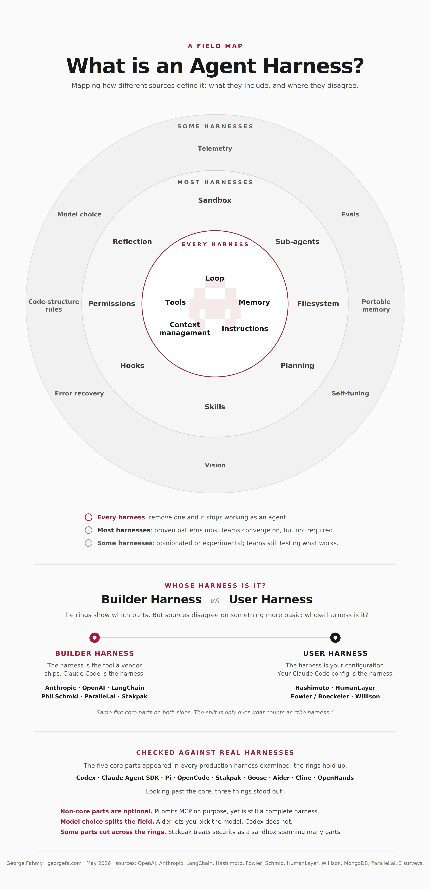

# Build an Agent Harness from Scratch

Code from the [Zomra session](https://app.zomra.io/free-sessions/1dbb3aeb-416f-4d0f-9c80-1d2ec53b8e64) by George Fahmy.

We build an agent harness step by step: call the model, add tools, wrap it in a loop, then manage context. Each script stands on its own and adds one concept on top of the previous.

## Table of Contents

- [What You'll Learn](#what-youll-learn)
- [Prerequisites](#prerequisites)
- [Setup](#setup)
- [0. What is an Agent Harness?](#0-what-is-an-agent-harness)
- [1. Calling an LLM](#1-calling-an-llm)
- [2. Tool Design](#2-tool-design)
- [3. Agent Loop](#3-agent-loop)
- [4. Context Management](#4-context-management)
- [5. Security and Guardrails](#5-security-and-guardrails)

## What You'll Learn

- **[0] Anatomy of a harness**: the five core parts every harness has, and who owns the harness (vendor or you)
- **[1] Calling an LLM**: the smallest possible call to a model, no abstractions
- **[2] Tool design**: how a tool call works end to end, plus 10 lessons from a year of building tools for a production agent
- **[3] Agent loop**: turning one tool call into an agent that runs until it's done
- **[4] Context management**: deciding what to keep, drop, or summarize so the agent stays sharp without breaking the cache and blowing up costs
- **[5] Guardrails**: keeping an agent from doing damage

## Prerequisites

- You're already using an AI coding tool (Cursor, Claude Code, Copilot, or similar)
- You can read and write Python
- Python 3.12+
- [uv](https://docs.astral.sh/uv/) installed
- AWS account with Bedrock access to `anthropic.claude-haiku-4-5` in `eu-north-1`

## Setup

Install dependencies:

```bash
uv sync
```

Configure AWS credentials (the scripts use Bedrock in `eu-north-1`):

```bash
aws configure sso
# or export AWS_ACCESS_KEY_ID / AWS_SECRET_ACCESS_KEY
```

Run any step:

```bash
uv run 1_client.py
```

## 0. What is an Agent Harness?

The harness is everything around the model. The infographic groups the parts into three rings: the five that show up in every production harness (loop, tools, memory, context management, instructions), the patterns most teams converge on (sandbox, sub-agents, hooks, planning, skills), and the more experimental ideas on the outside (telemetry, evals, self-tuning). It also covers a split worth being aware of: some people mean "the harness is what a vendor ships" (Claude Code is the harness), others mean "the harness is your configuration on top" (your Claude Code config is the harness).



## 1. Calling an LLM

`1_client.py`

The smallest possible thing. One call to Claude Haiku 4.5 on Bedrock, print the reply. No tools, no loop. This is the bare client you'll build everything else on top of.

## 2. Tool Design

`2_tools.py`

One full tool call from start to finish. Defines a `get_weather` tool, sends a user message, receives the model's request to call the tool, runs the Python function locally, sends the result back, and prints the model's final answer. Each step is labelled (`[User]`, `[Assistant → Tool]`, `[Tool → Assistant]`, `[Assistant]`) so you can trace the flow.

`2_tools_sequence.py`

Same agent, different view. Draws the same call as an ASCII sequence diagram with three lifelines (User, LLM, `get_weather`) and arrows between them. Useful when you want to see the back-and-forth visually instead of reading log lines.

[How to design better tools?](./2_tools_slides.html)

A 19-slide case study from a year of building tools for a production agent (~178 commits, ~17 tools). Covers what makes a tool name good, how descriptions tend to evolve, what to validate, when to expose a capability as a CLI instead of a tool, and how to design tools that are safe to undo. Ends with 10 lessons.

## 3. Agent Loop

`3_loop.py`

Turns the single tool call into an interactive agent. A `while True` loop does one of two things on each turn: if the model's last message ended naturally, ask the user for input; if the model asked to call a tool, run it and send the result back. The loop keeps going until you type `exit`, `quit`, or hit Ctrl+C.

This is the core of every agent. Everything else is layered on top.

## 4. Context Management

`4_context.py`

Same loop as step 3, plus a `view` tool so the agent can read files in the working directory (with a check that prevents it from escaping the directory), and a `project_context()` function that runs right before every model call.

That function is the whole point of this step. It does four things:

1. Counts the tokens about to be sent and shows how full the context window is.
2. Optionally rewrites the conversation before sending. Two strategies ship commented out: summarize old turns into one short message, or replace old tool outputs with `[truncated]` while keeping the last few.
3. Measures how much of the message list still matches the previous call. The model provider charges less and responds faster when the start of the prompt is unchanged from the last call (this is called prompt caching). Any rewrite to old messages breaks that match, so you can see the trade-off live.
4. Prints a one-line report each turn: message count, token usage, cache match before and after the rewrite.

Try a prompt like "read all the files in this project and tell me what it does", uncomment one of the strategies, and watch the numbers move.

## 5. Security and Guardrails

A model with tools can do real damage. Read [How to Build Agents That Can't Delete Your Database](https://georgefa.com/blog/agent-security) for patterns on sandboxing, secret redaction, and approval flows that we use in production at Stakpak.
